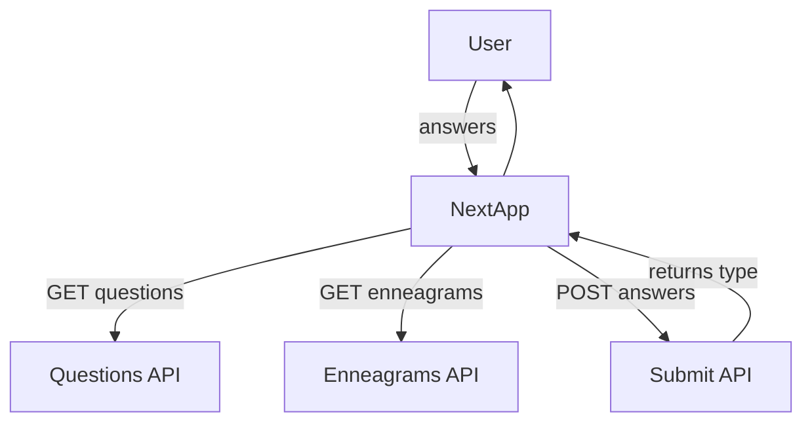

# Architecture

```mermaid
flowchart TD
    User -->|answers| NextApp
    NextApp -->|GET questions| API[Questions API]
    NextApp -->|GET enneagrams| API2[Enneagrams API]
    NextApp -->|POST answers| API3[Submit API]
    API3 -->|returns type| NextApp
    NextApp --> User
```

위 다이어그램은 사용자가 질문에 답변하고 결과를 받기까지의 기본 흐름을 나타냅니다.
